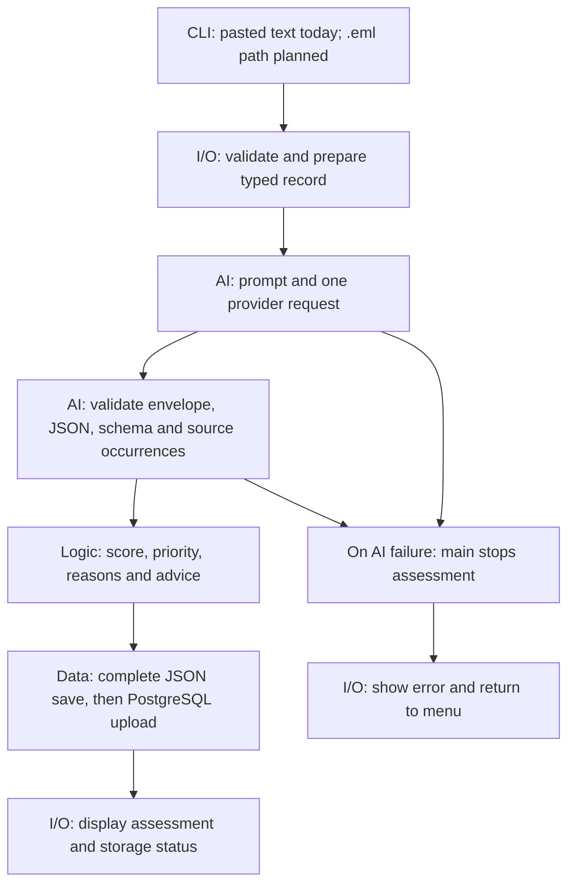

# PhishReport Project Roadmap 2.0

> **Team roadmap.** Retains each layer's ownership, deliverables and contribution history. Exact team conventions and optional features still require team adoption.
>
> **Progress reviewed:** 8 October 2026 — main at `74315ac`; merged team contributions are distinguished from the unmerged integration in [PR #25](https://github.com/lgf2111/INF1103-Project1-P9-G04/pull/25) at `1977e3f`.

## Contents

1. [General progress and deliverables](#general-progress-and-deliverables)
   1. [Expected end product and email-file workflow](#expected-end-product-and-email-file-workflow)
2. Four-layer architecture
   1. [Input Layer](#input-layer)
   2. [AI Processing Layer](#ai-processing-layer)
   3. [Logic Layer](#logic-layer)
   4. [Data Layer](#data-layer)
3. [Project structure and architecture](#project-structure-and-architecture)
4. [Team standards and task instructions](#team-standards-and-task-instructions)
   1. [Code rules and automatic checks](#code-rules-and-automatic-checks)
   2. [Task instructions](#task-instructions)
   3. [How we work together (Git)](#how-we-work-together-git)
   4. [Shared changes and completion](#shared-changes-and-completion)
   5. [Remaining workflow checks](#remaining-workflow-checks)
5. [Outstanding decisions](#outstanding-decisions)
6. [References](#references)
7. [Submission readiness checklist](#submission-readiness-checklist)

## General progress and deliverables

**Objective:** Assess suspicious email, SMS and chat messages with a procedural Python CLI. Use AI findings and phishing rules to produce prioritised JSON reports.

**Current stage:** Review PR #25, verify remaining integration risks and prepare the team submission. Confirm calendar deadlines against course announcements.

**Status key**

- **Implemented:** Present on the reviewed `main` commit.
- **In review:** Implemented in PR #25, not yet merged.
- **Deferred:** Outside the active scope; not an implementation task until agreed.
- **Partial:** Some acceptance criteria remain.
- **Pending:** No completion evidence yet.

Layer tables distinguish implementation from outstanding work. The final G1–G8 checklist applies to the submission version; record evidence in the relevant issue or PR.

### Project progress

| Area | Status | Current position |
| --- | --- | --- |
| Foundation and DevOps | Implemented | Guan Feng's project wiring, Groq starter, Docker, Ruff, CI, release automation and documentation remain the foundation. See FEATURES.md for original contribution records; release existence alone does not prove final readiness. |
| Input collection | Implemented | Jeremy's validated typed input and reusable choice helpers merged in PRs #19/#23. collect_input uses the helpers; email/SMS/chat manual entry works. |
| Output displays | Implemented | Bryan Lee's result, record and history display improvements merged in PR #22. Menu record selection/filter/status controls remain separate tasks. |
| Logic, extraction and PostgreSQL | Implemented / integration changes in review | Xavier/Bryan's work merged through PR #20. Their extraction rules and PostgreSQL contribution are retained; PR #25 proposes findings-driven rules and a compatible complete-record adapter. |
| AI hardening and combined assessment | In review | Arvin's original AI work is published on feat/ai-layer. PR #25 integrates it with main, retains extraction in one request, and restores required AI/logic interfaces. It is not merged. |
| File/history reliability | In review | PR #25 adds complete versioned records, atomic JSON, logged read failures and combined local/database history. Real PostgreSQL round-trip still needs verification. |
| Automated checks | Implemented; integration CI passed | Existing CI runs lint, no-class, offline tests and Docker. PR #25 has 450 passing offline cases on host/Docker and passing GitHub jobs. |
| Docker and delivery | Partial | Existing Dockerfile/helper retained. Isolated restart/persistent-mount checks passed for PR #25; all six machines and final submission version remain to verify. |
| File import and submission documents | Pending | .eml input, final report, instructor clarifications and demo evidence remain team work. |

**Review in progress:** PR #25 is related to issue #24. Review requested from Tr1ckster10, bryxnox27 and lgf2111; review-focus comments are posted, but no review has been submitted at this snapshot. Scope is four application files and five test files; existing I/O source is retained.

**Evidence limits:** one fictional live host Groq assessment passed validation and JSON save/reload (60 / MEDIUM); database upload was disabled. CLI/restart checks used mocked AI. No real PostgreSQL result, model-accuracy claim or all-machine verification is implied.

### Next checkpoints

1. Complete the requested interface/scenario review of PR #25 and address comments.
2. Verify PostgreSQL save/fetch against an isolated real database.
3. Obtain instructor clarification on repeatability and API calls for existing-record operations.
4. Agree the .eml input contract and any additional user-facing scope before implementation.
5. Verify the final submission commit on all six machines and complete G1–G8 below.

Merged contributions were checked against main `74315ac` and PRs #19/#20/#22/#23. PR #20 contains contributions from both Tr1ckster10 and bryxnox27. Feature existence is based on code; live database operation and unrecorded teammate tests are not assumed.

### Scope and requirements

**Course requirements**

- Four functional managers; input type/range validation; structured AI responses and rules combining AI fields.
- Numeric scoring used for ranking or thresholds; JSON/CSV persistence and repeatability.
- Offline tests, an engineering report, meaningful Git history and Docker delivery.

**Instant-fail constraints**

1. No team-authored class definitions.
2. Every processed record passes through the AI API; the application's main purpose depends on AI.

Whether viewing, filtering or updating existing records requires another call needs instructor clarification. Do not assume an exemption or use caching to bypass the requirement.

**Active product scope:** manual message assessment, retained extraction, response-priority advice, reliable JSON/history and the planned .eml input workflow. The specific extraction feature and file format are team choices.

**Deferred extensions:** history status updates, additional disclosure categories, stable IDs/deduplication and extra security APIs. Do not treat these as approved implementation tasks. Report selection/filtering requires a separate scope decision (I4/D3).

**Phase 1 exclusions:** Inbox integration, automatic monitoring, opening links or attachments, and claims that a message is guaranteed safe.

**Proposed users:** Non-specialist students and staff checking suspicious email, SMS or chat messages.

**Problem:** Users need help interpreting phishing indicators and choosing actions after clicking, downloading or disclosing information.

**Expected value:** Combine AI interpretation with reported user actions to produce a consistent priority, reasons, response checklist and saved history. Do not claim proven superiority or guaranteed safety.

**Measurable objectives**

- Define fictional normal, suspicious, exposure and insufficient-context cases with expected decisions.
- Pass every agreed rule case; reject malformed AI output without a successful assessment.
- Retrieve unchanged saved assessments after restart. Record exclusions and evaluation results in the report.

## Expected end product and email-file workflow

PhishReport helps a user assess suspicious content and decide what to do after receiving, clicking, downloading or disclosing information. It produces an explained **response priority**, not a guaranteed phishing verdict or calibrated probability.

**Current CLI input:** check message, view saved reports and quit; pasted email/SMS/chat text, optional sender/link/file information and reported actions. **Integration under review:** PR #25 supplies the combined assessment flow below. It is not yet the main-branch implementation.

**Planned email workflow:** the user supplies a `.eml` file path in the CLI. `.eml` is the selected development direction; parsing is not implemented by PR #25. Input owners must settle MIME/text handling, limits, parsed fields and how manual SMS/chat input remains available before implementing it. This is a team product direction, not a professor-mandated file format.



Expected user journey:

1. Choose a new assessment and supply the content. For future `.eml` import, I/O validates and reads the file and re-prompts if unusable.
2. Report whether a link was clicked, a file downloaded, or a password/OTP disclosed. Collect categories only, never the actual password or code. Reading an email cannot infer these actions.
3. Send decoded content and agreed unverified metadata to AI. Do not send the local file path or user-action answers as provider input.
4. Validate the AI response before scoring or storing it. A failed assessment is not saved or displayed as completed.
5. Display LOW/MEDIUM/HIGH priority, score, reasons and advice. Preserve the complete assessment in JSON; distinguish failed local saving from successful local saving with failed database upload.
6. View stored history after restart. Current history reads stored results without another API request; instructor interpretation of that behaviour remains unresolved.

Never execute attachments, visit links, fetch remote email images or claim a message is guaranteed safe. Receiving a link or seeing an extracted contact is not, by itself, a risk score increase.

The diagram describes the PR #25 integration plus planned file input. `.eml` parsing remains pending; it is not implied by the presence of a file-name input field.

## Input Layer

### In charge: Jeremy Goh & Bryan Lee

**Purpose:** Collect structured message details and reported user actions. Display assessments, reports, lists and errors.

**Boundary:** All terminal input/output belongs in `io_manager.py`.

### Deliverables and progress

| ID | Current status | Remaining action |
| --- | --- | --- |
| I1 — Complete input record | **Partial:** manual ten-field collector and helper wiring merged in PRs #19/#23. | Agree .eml decoded fields, MIME/text handling and channel scope; implement file import separately. |
| I2 — Input validation | **Partial:** choices, blanks, optional text and boolean/category conversion implemented; manual re-prompt tests exist. | Agree and test file/read/size limits and any new input constraints. No numeric limit is prescribed by the framework. |
| I3 — Displays | **Partial:** display_result, display_record and display_list merged in PR #22; result/list are called by main. | Decide how users select full records and whether to present extracted contacts. Do not count those controls as implemented. |
| I4 — History controls | **Deferred:** no selection/filter/status menu is implemented. | Agree scope before adding controls; coordinate filter/query and any status identity with data owners. |
| I5 — Tests and integration | **Partial:** manual collection/display tests exist; PR #25 combined handoff tests pass. | Test the future file-input handoff when implemented; preserve application terminal I/O confinement. |

**Contribution evidence:** Jeremy — [PR #19](https://github.com/lgf2111/INF1103-Project1-P9-G04/pull/19), [PR #23](https://github.com/lgf2111/INF1103-Project1-P9-G04/pull/23); Bryan Lee — [PR #22](https://github.com/lgf2111/INF1103-Project1-P9-G04/pull/22). The [pushed I/O source](https://github.com/lgf2111/INF1103-Project1-P9-G04/blob/74315ac/app/io_manager.py) is retained by PR #25.

## AI Processing Layer

### In charge: Arvin (Akari-light) & Guan Feng (lgf2111)

**Purpose:** Send processed records through the real AI API; build prompts, parse JSON and validate findings before the logic layer uses them.

**Boundary:** Keep phishing decisions and scoring outside `ai_manager.py`. Existing history viewing uses stored results; clarify the API requirement for existing-record operations with the instructor.

### Deliverables and progress

| ID | Current status | Remaining action |
| --- | --- | --- |
| A1 — Schema and prompt | **In review:** four required interfaces and combined findings/extraction contract in PR #25. | Review the contract; add future parsed-email fields only through an agreed producer/consumer change. |
| A2 — Extraction | **In review:** existing teammate extraction retained in one assessment response with syntax and ordered source checks. | Review retained semantics. Source matching is not proof of extraction completeness. |
| A3 — Formatting call | **Retired in PR #25:** procedural display replaces the second request; obsolete helpers removed. | No separate formatting API feature is planned. |
| A4 — Failures | **In review:** strict envelopes/JSON/schema, safe logging and no-completion-on-failure are tested. | Address review feedback and verify the submission version. |
| A5 — Configuration | **Implemented baseline:** runtime key/model, blank-model rejection and socket timeout merged through PR #25. **Branch work:** bounded retries and optional timeout fallback on feat/ai-fallback. | Review the retry policy below; verify live fallback availability, latency and assessment quality before recommending a model pair. |
| A6 — Verification | **Partial:** offline/combined tests and one fictional host API handoff passed. | Final submission checks remain; no model-accuracy or live-container-API claim. |

**Contribution evidence:** Guan Feng's initial Groq foundation; Arvin's published feat/ai-layer and [PR #25](https://github.com/lgf2111/INF1103-Project1-P9-G04/pull/25); retained extraction from the logic pair's [PR #20](https://github.com/lgf2111/INF1103-Project1-P9-G04/pull/20). Main still uses the earlier flow until PR #25 merges.

## Logic Layer

### In charge: Bryan (bryxnox27) & Xavier (Tr1ckster10)

**Purpose:** Combine validated AI findings and reported actions into an assessment, score, outcome and response checklist.

**Boundary:** Keep API requests, terminal interaction and file access outside `logic_manager.py`.

### Deliverables and progress

| ID | Current status | Remaining action |
| --- | --- | --- |
| L1 — Decision table | **In review:** explicit first-match response-priority rules, including suspicious AND credential_request. | Logic owners review the rule table and scenarios below. |
| L2 — Required functions | **In review:** evaluate(record), score(record), route(record) return the agreed decision data. | Confirm the shared record/result interface. Main currently has evaluate(record, details). |
| L3 — Numeric scoring | **In review:** 10/35/45/60/80/90 scores and 35/70 thresholds tested. | Validate operational priorities; do not describe scores as phishing probabilities. |
| L4 — Exposure/uncertainty | **In review:** password/OTP disclosure, clicks/downloads, negative AI and uncertainty scenarios tested. | Review advice for supported actions; additional disclosure categories are deferred. |
| L5 — Extraction compatibility | **In review:** validated extraction retained in the saved assessment; obsolete pass-through-only helper retired. | Confirm compatibility with the retained extraction rules. |
| L6 — Offline tests | **In review:** fixed AI scenarios, thresholds, precedence, invalid-input and unchanged-input tests pass. | Retest substantive rule changes and the final submission version. |

**Contribution evidence:** Xavier/Bryan's [PR #20](https://github.com/lgf2111/INF1103-Project1-P9-G04/pull/20) introduced detail validation/handoff, additive scoring, priorities and guidance. [PR #25](https://github.com/lgf2111/INF1103-Project1-P9-G04/pull/25) changes those rules and interfaces for the combined assessment; their original contribution remains in history.

## Data Layer

### In charge: Bryan (bryxnox27) & Xavier (Tr1ckster10)

**Purpose:** Save and retrieve evaluated JSON reports across runs; support history, filters and any agreed status updates.

**Boundary:** Keep assessment rules and terminal display outside `data_manager.py`.

### Deliverables and progress

| ID | Current status | Remaining action |
| --- | --- | --- |
| D1 — Record contract | **In review:** complete versioned input/AI/result replaces the earlier eight-field report; existing PostgreSQL columns retained. | Review JSONB payload and legacy compatibility. Stable IDs/status fields are deferred. |
| D2 — Persistence/startup | **Implemented baseline; extension in review:** JSON save/load and PostgreSQL upload/fetch/startup exist on main; PR #25 combines local/database history and logs read failures. | Verify full/legacy round-trips in an isolated real database. |
| D3 — Query/updates | **Implemented helper; controls deferred:** query(filter_fn) exists, but no menu filter/status update. | Coordinate scope with I4 before adding controls. |
| D4 — Safe file handling | **In review:** validation, atomic writes, corrupt-file preservation and I/O-only notices tested. | Review error contracts and final submission behaviour. |
| D5 — Compatibility/repeatability | **Partial:** JSON/legacy and mocked DB round-trips pass; saved output survives restart. | Obtain instructor interpretation and test required fresh-assessment repeatability; reload is not equivalent. |
| D6 — Docker/tests | **Partial:** isolated persistent-mount restart passed; offline data tests pass. | Finalise persistent run instructions and verify on all six machines. |

**Contribution evidence:** Xavier/Bryan's [PR #20](https://github.com/lgf2111/INF1103-Project1-P9-G04/pull/20) provides JSON/PostgreSQL storage, bound inserts, fetch and startup/fallback handling. PR #25 extends reliability and record completeness without a new SQL schema migration. Code/mocked tests do not establish live database compatibility.

## Project structure and architecture

Keep the existing `app/` layout and four manager files, coordinated by `main.py`. Tests remain under `tests/`; existing Docker, lint, CI and release files remain in place. No layout migration or new design-document directory is required by this roadmap.

Use functions/dictionaries without authored class definitions. Add helpers to their responsible manager; introduce a new module only for a distinct responsibility. Update shared interfaces, callers and tests together. Keep README run/configuration instructions current and retain FEATURES.md contribution history.

The proposed integration contract is documented below; record proposed changes and review decisions in the relevant issue/PR. Exclude credentials, private references, logs and user reports from Git and Docker build context.

### Responsibility boundaries

I/O means **user interaction** in this architecture. API communication belongs to AI and persistence belongs to data. Detecting an error, deciding whether processing continues and displaying the error are separate responsibilities.

| Concern | Owner | Boundary |
| --- | --- | --- |
| Menu choices, required user fields, future file existence/readability/MIME parsing | `io_manager.py` | Re-prompt on invalid user input; return a typed dictionary. All application `print()` and `input()` calls live here. |
| Prompt input contract | `ai_manager.py`, after I/O validation | Enforce valid input even when another caller or test invokes AI directly. AI does not open email paths. |
| Provider envelope, completion/refusal checks, JSON parsing and response schema | `ai_manager.py` | Validate provider-specific structures before consuming them; I/O need not understand Groq fields. |
| API errors/timeouts, key/model checks and safe diagnostics | `ai_manager.py` | Consume configuration, emit sanitised logs and signal failure. Do not print, prompt, score or save. |
| Environment loading and log destination/format | `main.py` at startup | Load settings before processing; attach and clean up AI/data log handlers. |
| Continue/stop processing and call the next manager | `main.py` | AI failure stops scoring and saving; delegate user messages to I/O. |
| Score, priority, reasons and response advice | `logic_manager.py` | Apply domain rules to validated AI findings and reported actions. No API, terminal or file operations. |
| JSON/PostgreSQL access, record structure and history | `data_manager.py` | Preserve evaluated records, validate storage structure and report storage errors. No domain scoring or terminal output. |
| Display results/failures and return to the menu | I/O, coordinated by `main.py` | Show helpful messages without provider bodies, secrets or raw exception details. |

For malformed model JSON: **AI detects, logs and signals failure → main stops this record → I/O shows the failure → menu remains available**. Moving JSON parsing into I/O would contradict the framework's required AI interfaces.

The Phase 1 rule prohibits authored class definitions in application code and tests. Using library objects such as `urllib.request.Request`, logging handlers or mocks does not define a class in this project. Phase 2 class/subclass targets are future work.

### Integration contract under review

These contracts are implemented in PR #25 and await independent interface review. Additional `.eml` fields must be agreed with producers and consumers before use.

- **Input record:** `channel`, `sender`, `message`, `has_link`, `link`, `has_file`, `file_name`, `clicked`, `downloaded`, `submitted_category`. Flags are booleans; optional text is a string or `None`; submitted category is `password`, `otp` or `None`; message is nonblank text.
- **AI prompt:** `build_prompt(record)` includes message and optional sender/link/file_name as untrusted JSON-encoded data. User actions remain with logic. The other mandatory interfaces are `call_api(prompt)`, `parse_response(raw)` and `validate_response(data)`.
- **AI output:** exactly `credential_request`, `suspicious`, `insufficient_context` (actual booleans), and `details` containing exactly `emails`, `phone_numbers`, `ip_addresses` (string lists). Source validation checks exact ordered occurrences in message text before logic/storage. It does not prove extraction completeness or model truth.
- **Retained extraction:** existing email subset, eight-digit phones including grouped digits, and IPv4/IPv6; preserve exact text, order and repeats. No second formatting API call.
- **Logic:** `evaluate(record)` consumes the input enriched with `ai`, returning `score`, `priority`, `reasons`, `checklist`. `score(record)` and `route(record)` are public functions. Inputs are not mutated.
- **Storage:** original input fields plus `schema_version: 1`, `ai` and `result`. PostgreSQL retains its columns and stores the complete versioned record inside `details` JSONB. Legacy records keep their recorded fields; missing information is not fabricated.
- **Read failures:** ordinary `load()` logs and returns `[]`; internal strict reads distinguish failure from empty history and prevent overwrite. A missing file is empty history. Only I/O displays notices.
- **History:** combine both sources by full-record equality once per occurrence, retaining the greater count. This is display reconciliation, not synchronisation or proof of identity. Repeated uploads can still create database duplicates.
- **Configuration:** startup loads environment settings. AI reads `GROQ_API_KEY` and `GROQ_MODEL` at request time; default model `openai/gpt-oss-20b`; blank model rejected. The merged PR #25 baseline used one attempt. The unmerged feat/ai-fallback policy is described below. No secrets or raw message/provider content in normal AI diagnostics.

**Retry policy — feat/ai-fallback, pending review (9 October 2026)**

The retry transport lives in `app/ai_manager/client.py`, on top of the package refactor merged through PRs #42/#43. Public AI interfaces remain available from `ai_manager`; the old flat module is not restored.

- Maximum two provider requests per assessment, each with a 30-second socket timeout. This is not a total wall-clock deadline; a timed-out request may already have consumed provider quota.
- A timeout retries using optional `GROQ_FALLBACK_MODEL`; unset means the same primary model. A configured fallback must be nonblank and different from the primary. The complete prompt and response settings are preserved.
- Recognised transient connection/read failures and HTTP 500/502/503/504 retry the same model after 0.5–1.5 seconds of backoff. HTTP 504 alone does not prove model slowness.
- HTTP 429 retries the same model only when `Retry-After` supplies valid seconds or an HTTP date with a wait of at most five seconds. Missing, invalid or longer waits fail safely; the model is not rotated to bypass a limit.
- Invalid credentials/configuration, other HTTP errors, refusal, malformed responses and invalid assessment fields are not automatically retried. Exhaustion uses the existing failure path before scoring or saving.
- The optional fallback implements the reported suggestion to try another model after excessive waiting. Older/smaller does not guarantee faster or equivalent findings. The example model pair is illustrative; live availability, latency and quality remain unverified. No default fallback is enabled.

Rules use the **first matching row**:

| Condition | Score | Priority |
| --- | ---: | --- |
| User reports password or OTP disclosure | 90 | HIGH |
| AI suspicious AND user clicked/downloaded | 80 | HIGH |
| AI suspicious AND AI credential_request | 60 | MEDIUM |
| AI suspicious | 45 | MEDIUM |
| AI insufficient_context | 35 | MEDIUM |
| Otherwise | 10 | LOW |

Routing thresholds are HIGH at 70 or above, MEDIUM at 35 or above, otherwise LOW. AI must still succeed before evaluating disclosure. Credential request alone does not establish phishing. Review these as response-priority rules, not probabilities.


## Team standards and task instructions

**Draft team standards:** Exact issue/commit formats, review counts and merge methods still need team adoption. Descriptive history and focused branches remain course requirements. Give each task one individual owner and one reviewer; layer ownership does not replace task assignments.

### Code rules and automatic checks

GitHub Actions runs these checks on pushes and pull requests:

1. **No classes.** Phase 1 requires functions only. CI searches all tracked Python files, including tests and root helpers. A found class definition fails the check.
2. **Lint (Ruff).** Flags unused code, import-order problems and other configured issues. Run it locally if installed:

   ```bash
   ruff check .
   ```

3. **Offline tests.** Run `pytest` without a live API key. Update tests when changing rules or other assessed behaviour.
4. **Docker build and tests.** CI builds the image and runs the offline tests inside it. This does not replace the final interactive run on every team laptop.

A green CI result still needs review and submission-version verification.

### Task instructions

Create one GitHub issue per focused task using the relevant roadmap ID.

| Field | Required content |
| --- | --- |
| Title | Layer and concrete action, e.g. `I1: Add validated email-file input`. |
| Owner / reviewer | One implementer and one reviewer; paired implementers use a third reviewer. |
| Scope | Functions/files to change and the required behaviour. |
| Contract | Input fields/types, output fields/types and error behaviour, or a link to the agreed design section. |
| Dependencies | Blocking task IDs and interface decisions. |
| Acceptance criteria | Observable outcomes, including failure cases. |
| Verification | Tests or reproducible manual steps and expected results. |
| Evidence | PR link, test results and any remaining work. |

Write instructions as **action + expected result**. Use **must** for requirements and **proposed** for unresolved choices. Put explanations and discussion in issue comments; keep the roadmap to scope, status, decisions and acceptance criteria.

Task states: **Backlog -> Ready -> In progress -> In review -> Done**. Move to Ready when scope, contracts and dependencies are settled. Record blockers on the issue. Update the issue and layer progress table when work merges.

### How we work together (Git)

#### Branches and commits

Normally start each task from current `main`. PR #25 deliberately began from the original AI branch and merged main to preserve both contribution histories. Use short-lived task branches; do not push directly to `main` or use permanent personal branches.

| Item | Format | Example |
| --- | --- | --- |
| Branch | `<type>/<issue-number>-<short-description>` | `feat/21-input-record` |
| Commit | `<type>(<scope>): <short action>` | `feat(io): collect channel and sender` |

Types: `feat`, `fix`, `test`, `docs`, `refactor`, `ci`, `chore`. Scopes: `io`, `ai`, `logic`, `data`, `app`, `repo`, `build`. Use lowercase branch names, hyphens and real issue numbers.

Complete one meaningful tested block, commit it, then continue. For observed defects, write and demonstrate a failing regression before the fix; do not fabricate failures for documentation or cleanup. Commit coherent changes early and often with accurate authorship. Push and sync task branches regularly, including before handoffs and review. Preserve existing contributor history. Separate unrelated work and behaviour changes from structural moves.

#### Pull requests and merging

- Open one focused PR to `main`; link its issue and state changes, verification and outstanding work.
- Obtain one non-author approval. Paired authors require a third reviewer.
- Pass applicable CI checks and resolve review comments. Obtain another review after substantive changes.
- Update local `main` with a fast-forward-only pull. Investigate divergence instead of forcing it.
- Update published/shared branches by merging `origin/main`; resolve conflicts with affected contributors and rerun checks.
- Rebase only exclusively local, unpublished commits that nobody depends on.
- Merge approved PRs using **Create a merge commit**. Do not squash, rebase shared history or force-push routinely.
- After merging, update tracking and delete the completed task branch when no longer needed.

### Shared changes and completion

Guan Feng's existing DevOps contribution is retained. Agree responsibility for the final CI/Docker verification record; each member runs the submission version on their own machine.

Agree contract changes with affected layer owners before implementation. Update producers, consumers, tests and design documentation together. Assign an owner/reviewer explicitly for shared `main.py`, Docker, CI and documentation tasks.

**Done:** Acceptance criteria met; checks passed; independent review complete; merged into `main`; affected documentation and progress updated.

### Remaining workflow checks

- Confirm team adoption of the proposed naming/review/merge conventions and individual task assignments.
- Confirm required-check/review protection settings; this roadmap does not change repository settings.
- Existing CI paths, lint, no-class, offline and Docker checks work for PR #25. An automated I/O-boundary CI check is a separate improvement; local verification has passed.
- Verify final run instructions, persistent storage and all-machine evidence before submission.

## Outstanding decisions

| Decision / verification | Responsible | Needed for |
| --- | --- | --- |
| Review PR #25 contracts, retained extraction, rule table and error handoffs | AI/logic/data reviewers; I/O review where affected | Integration merge |
| Real PostgreSQL full/legacy save/fetch verification | Data owners; agree an individual tester and isolated database | Live compatibility evidence |
| .eml parsing, limits, decoded fields and relationship to manual SMS/chat | Input owners with AI/logic owners | File-input implementation |
| Same-input/same-output interpretation and API requirement for existing-record operations | Instructor clarification; agree who obtains it | Coursework compliance |
| Evidence of topic sign-off, repository/access details and submission dates | Team; assign coordinator | G1/G5 and delivery |
| Final report, all-machine Docker record and demo responsibilities | All members with individual assignments | G4/G6/G8 |

No implementation is scheduled for deferred features until its scope is agreed. An in-review implementation is not automatically accepted by its layer owners or the instructor.

## References

- Merged team work: [input PR #19](https://github.com/lgf2111/INF1103-Project1-P9-G04/pull/19), [logic/data PR #20](https://github.com/lgf2111/INF1103-Project1-P9-G04/pull/20), [display PR #22](https://github.com/lgf2111/INF1103-Project1-P9-G04/pull/22), [input refactor PR #23](https://github.com/lgf2111/INF1103-Project1-P9-G04/pull/23).
- In-review integration: [issue #24](https://github.com/lgf2111/INF1103-Project1-P9-G04/issues/24), [PR #25](https://github.com/lgf2111/INF1103-Project1-P9-G04/pull/25).
- FEATURES.md retains original foundation/DevOps contribution records; do not use its historical test counts as current integration evidence.
- Team Project Framework - Phase 1: mandatory functions, constraints and deliverables.
- Team Project Specification: collaboration, Docker verification and remaining Week 7/8 checkpoints.
- Project Initial Details: repository access and submission requirements.
- Grading Criteria1: problem clarity, domain integration, procedural logic, function definition, architecture, DevOps and robustness.

The course PDFs are kept locally in `.local/`; these document titles are not links to repository files.

## Submission readiness checklist

Check each item only when its acceptance criteria above pass on the submission version and the evidence is recorded.

- [ ] **G1 — Approved scope:** instructor topic sign-off and one-paragraph problem statement recorded.
- [ ] **G2 — Procedural application:** all four managers and required functions work; procedural, AI-core, validation and I/O constraints verified.
- [ ] **G3 — Automated tests:** offline logic tests, including the two-AI-field rule, pass inside Docker.
- [ ] **G4 — Engineering report:** no more than five pages; data-flow diagram and exception matrix share a page.
- [ ] **G5 — Git repository:** correct URL and access, Project Initial Details submission, descriptive history and reviewed changes verified.
- [ ] **G6 — Docker delivery:** submission version runs with persistent reports and is verified on all six laptops.
- [ ] **G7 — Integrated app:** agreed normal, exposure, uncertain, failure, storage and repeatability cases pass.
- [ ] **G8 — Demonstration:** full pipeline, failures and offline tests rehearsed; every member can explain their contribution.
